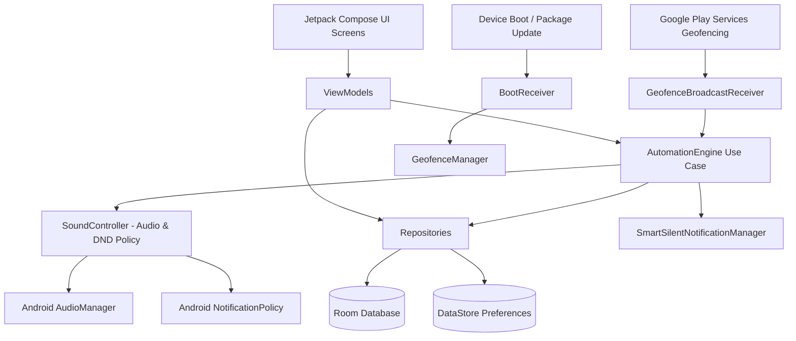
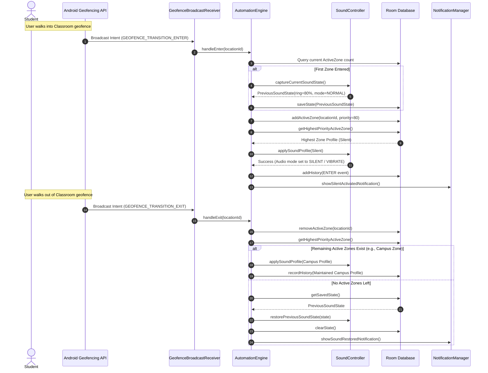
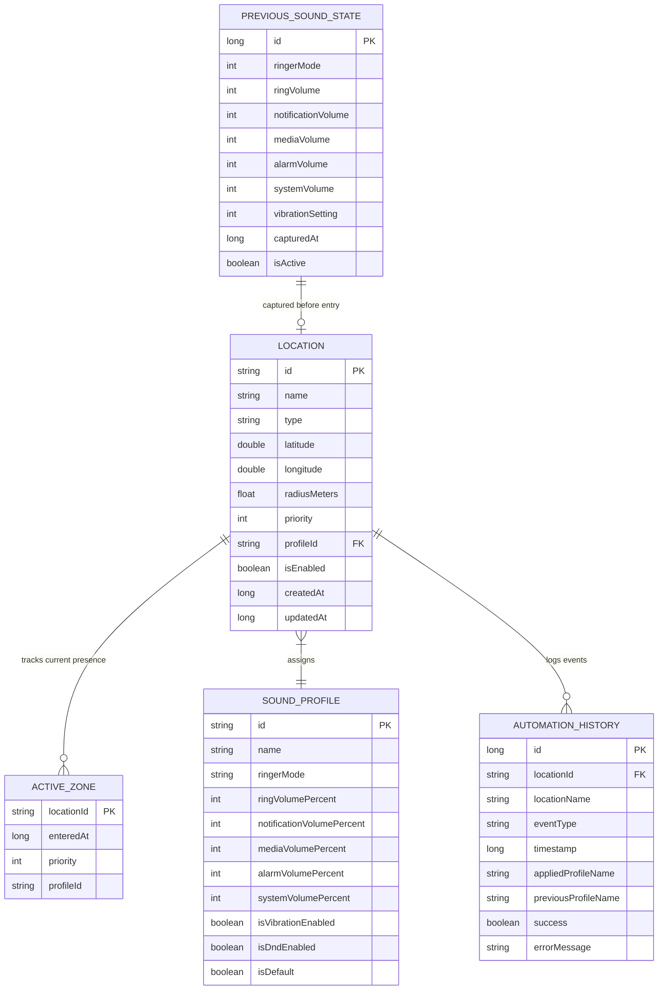

# SMART SILENT CAMPUS — SYSTEM ARCHITECTURE & ENGINEERING REPORT

## 1. System Architecture

The application follows Google's recommended Clean Architecture with unidirectional data flow (UDF).

---

## 2. Geofence Transition & State Restoration Sequence

---

## 3. Database Entity Relationship Diagram (ERD)

---

## 4. Multi-Zone Priority Engine

When a student moves between nested zones (e.g., College Campus $\rightarrow$ Library $\rightarrow$ Exam Hall), the engine dynamically resolves priority:

| Zone Type | Priority Weight | Typical Default Behavior |
| :--- | :--- | :--- |
| **Examination Hall** | `100` | Strict Silence / DND, No Vibration, 0% Media |
| **Classroom** | `80` | Silent Mode, Vibrate Off |
| **Laboratory** | `70` | Silent Mode, Vibrate Off |
| **Library** | `60` | Silent Mode, Vibrate On, Media 20% |
| **Seminar Hall** | `50` | Silent Mode |
| **College Campus** | `30` | Vibrate Only / Campus Silent |
| **Hostel** | `20` | Normal Mode |
| **Custom Zone** | `10` | User Configured |
